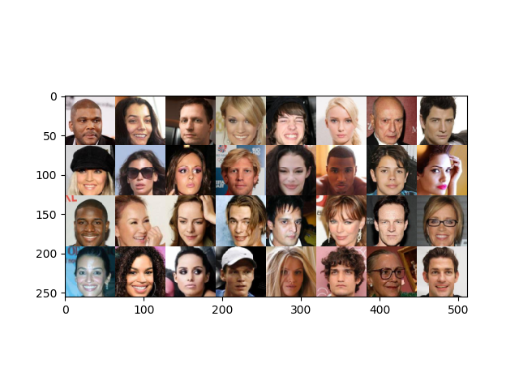
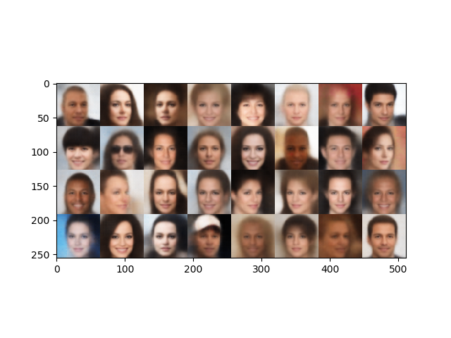
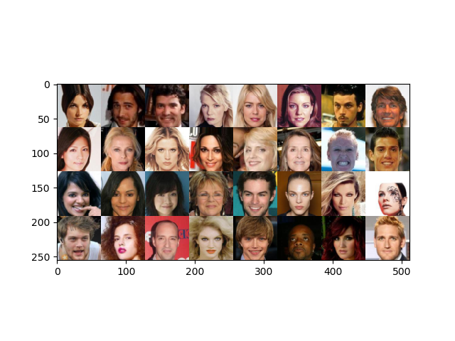
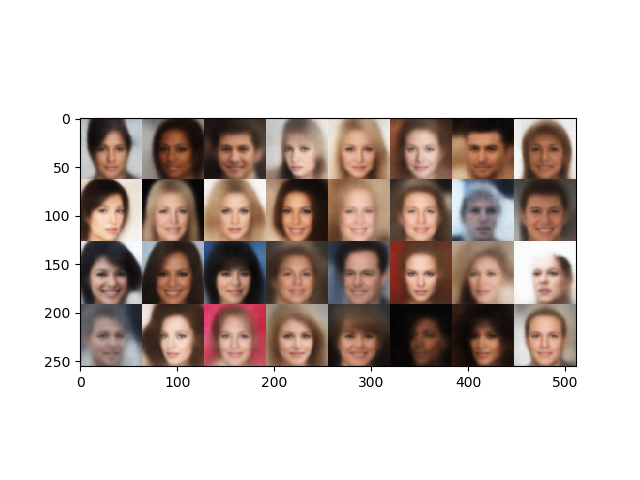
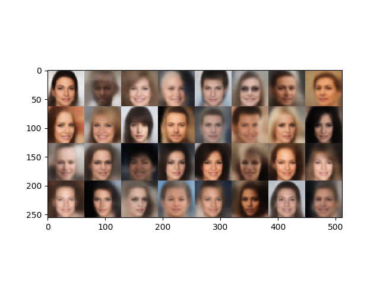

# Variational Autoencoder
Implementation in PyTorch of the Variational Autoencoder (VAE), firstly introduced in

Diederik P. Kingma and Max Welling "Auto-encoding variational bayes." *arXiv preprint arXiv:1312.6114* (2013). URL http://arxiv.org/abs/1312.6114.

## Model architecture
The architecture of the VAE is customisable via command line, run ``train_vae.py --help`` for more details.

**Constraint:** the architecture of the decoder is the transposed of the encoder's.

## Results in the CelebA dataset
The VAE with the default parameters was trained on the CelebA dataset. This pre-trained model is available in the [models](https://github.com/dpernes/vae/tree/master/models) directory in this repository. The dataset is available at its [official website](http://mmlab.ie.cuhk.edu.hk/projects/CelebA.html). See some results below.

**Training images** (original vs. reconstruction)

	
  

**Testing images** (original vs. reconstruction)

	
  

**New examples**

	

